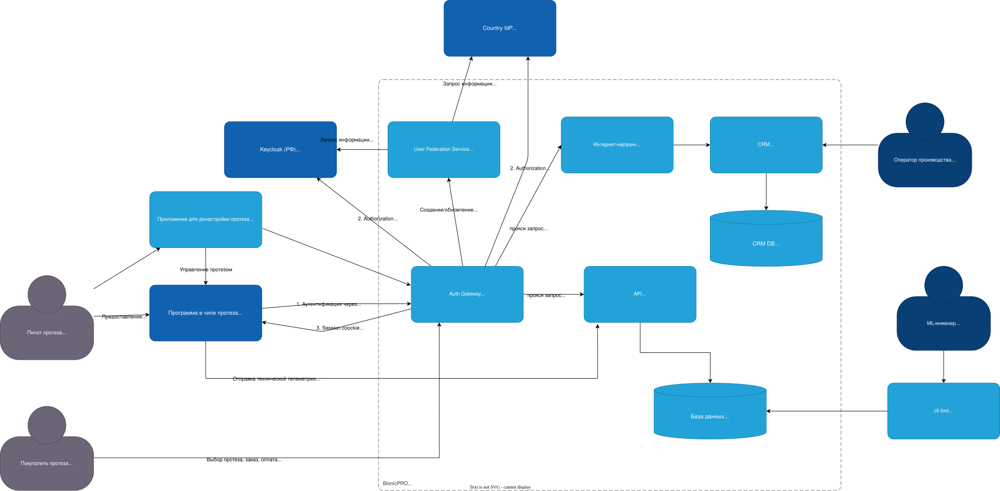

# Задание 1. Повышение безопасности системы

## Задача 1. Архитектура TO BE



## Обоснование соответствия схемы решению задачи 1

### 1. Унификация доступа в системе BionicPRO через внешний источник

**Термин: Унификация доступа** — единая точка входа для всех пользователей и приложений с централизованным управлением учетными записями.

**Реализовано:**

* **Auth Gateway** выступает единой точкой входа для всех клиентов (мобильное приложение)
* **User Federation Service** синхронизирует пользователей из разных IdP и хранит только reference-идентификаторы
* PostgreSQL содержит только ссылки на учетные записи (user_id из IdP), а не сами ПДн
* При аутентификации система всегда обращается к региональному IdP, а не к локальной БД

### 2. Безопасная схема работы с access- и refresh-токенами

**Термин: BFF (Backend for Frontend)** — сервис-посредник между фронтендом и микросервисами, который изолирует клиента от внутренней архитектуры.

**Реализовано:**

* Токены хранятся только на сервере (в Auth Gateway)
* Фронтенд получает только HTTP-only session cookie (недоступна через JavaScript)
* Auth Gateway инициирует OIDC Authorization Code Flow с PKCE
* Токены обновляются автоматически на сервере без участия клиента
* Session cookie имеют флаги: HttpOnly, Secure, SameSite=Strict

### 3. Поддержка аутентификации через разные внешние службы в разных странах

**Термин: OIDC (OpenID Connect)** — протокол аутентификации поверх OAuth 2.0, позволяющий клиентам проверять личность пользователя.

**Реализовано:**

* Поддержка нескольких IdP: Keycloak (РФ), международные провайдеры
* Auth Gateway определяет целевой IdP по domain/subdomain или геолокации
* User Federation Service абстрагирует различия между IdP
* Соблюдение требований локального хранения данных:
  * Аутентификация происходит в стране пользователя
  * Персональные данные не покидают страну (хранятся в региональном IdP)
  * В PostgreSQL только reference ID, не являющиеся ПДн

### 4. Соблюдение принципов локального хранения данных

**Термин: Data sovereignty (суверенитет данных)** — требование хранить персональные данные граждан на территории страны их происхождения.

**Реализовано:**

* Медицинские и персональные данные остаются в региональном IdP
* User Federation Service не копирует ПДн, а только связывает учетные записи
* При запросе данных пользователя API обращается к Federation Service, который при необходимости получает данные из IdP

## Задача 2. Замена Code Grant на PKCE

На начальном этапе

| Сервис             | Технология         | Порт                           | Описание                                 |
| ------------------ | -----------------  | -----------------------        | --------------------------               |
| **Frontend**       | React + TypeScript | [3000](http://localhost:3000/) | Веб-интерфейс пользователя               |
| **Аутентификация** | Keycloak           | [8080](http://localhost:8080/) | Управление пользователями и безопасность |
| **БД Keycloak**    | PostgreSQL         | [5433](http://localhost:5433/) | База данных аутентификации               |

Внёс правку в настройки realm и добавил страницу для корректной работы.
В файле App.tsx произведены подключение и инициализация нужных зависимостей.

Как проверить, что работает:

```bash
docker-compose up -d
```

Для проверки можно авторизоваться под любым пользователем из импортируемого realm.
