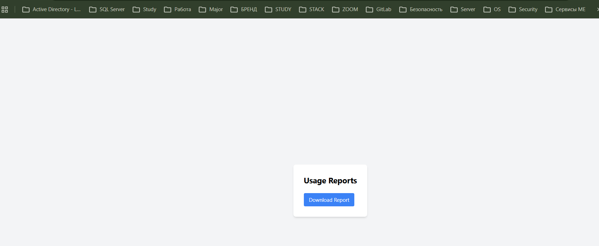
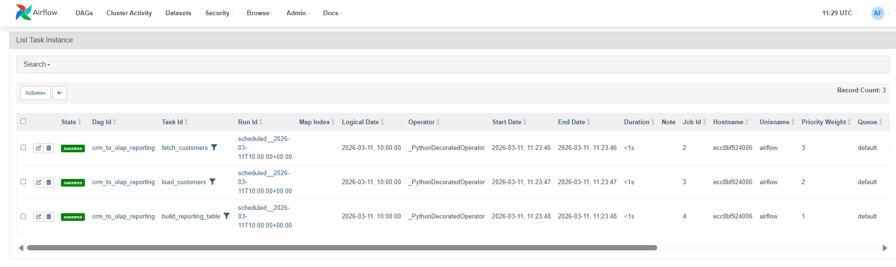
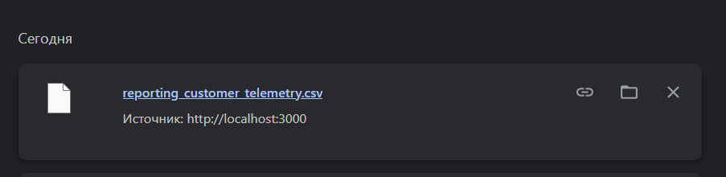
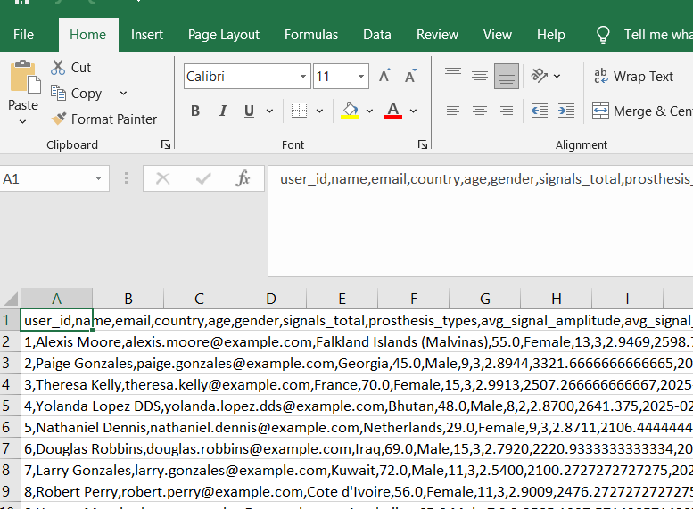
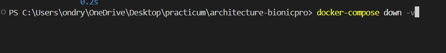

# Задание 2. Разработка сервиса отчётов

## Задача 1. Создать архитектуру решения для подготовки и получения отчётов

Зелёным цветом подсветил добавленные элементы.

## Задача 2. Разработать Airflow DAG и настроить его на запуск по расписанию

Добавлен каталог `airflow` и обновлён `docker-compose.yaml`

## Задача 3. Создайте бэкенд-часть приложения для API + обновление ГШ

Запуск приложения `docker compose up -d`

Перечень всех запущенных подсистем удобно посмотреть в `Docker Fesctop`

## BugFix 1

### Добавил поьтерянные данные

### DAG отработал

### Отчёт скачался

### Примечание по перезапуску

Лучше убить старые volumes перед перезапуском

